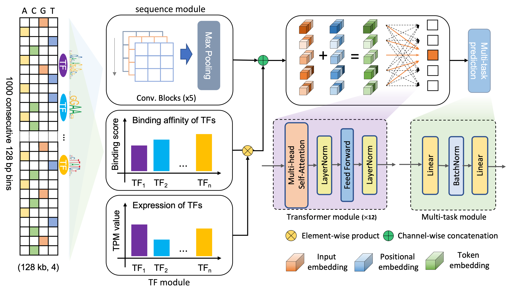

# EpiGePT

<div align=center>

</div>  


EpiGePT is a transformer-based model for cross-cell-line prediction of chromatin states by taking long DNA sequence and transcription factor profile as inputs. With EpiGePT, we can investigate the problem of how the trans-regulatory factors (e.g., TFs) regulate target gene by interacting with the cis-regulatory elements and further lead to the changes in chromatin states. Given the expression profile of hundreds of TFs from a cellular context, EpiGePT is able to predict the genome-wide chromatin states given the cellular context.


## Table of Contents

- [EpiGePT](#epigept)
  - [Table of Contents](#table-of-contents)
  - [Requirements](#requirements)
  - [Install](#install)
  - [Reproduction](#reproduction)
    - [Model training](#model-training)
    - [Model predicting](#model-predicting)
    - [Pretrain Models](#pretrain-models)
  - [Contact](#contact)
  - [Citation](#citation)
  - [License](#license)

## Requirements

- TensorFlow==1.13.1
- Python==2.7.1


## Install

EpiGePT can be downloaded by
```shell
git clone https://github.com/ZjGaothu/EpiGePT
```
Software has been tested on a Linux (Centos 7) and Python environment. A GPU card is recommended for accelerating the training process.

## Reproduction

This section provides instructions on how to reproduce results in the original paper.

### Model training

We trained 

The main python script `main_density_est.py` is used for implementing Roundtrip. Model architecture for Roundtrip can be find in `model.py`. Data loader or data sampler can be find in `util.py`.

Taking the (1) for an example, one can run the following commond to train a Roundtrip model with indepedent Gaussian mixture data.

```shell
CUDA_VISIBLE_DEVICES=0 python main_density_est.py  --dx 2 --dy 2 --train True --data indep_gmm --epochs 100 --cv_epoch 30 --patience 5
[dx]  --  dimension of latent space
[dy]  --  dimension of observation space
[train]  --  whethre use train mode
[data]  --  dataset name
[epochs] -- maximum training epoches
[cv_epoch] -- epoch where (cross) validation begins
[patience] -- patience for early stopping
```
After training the model, you will have three part of outputs, which are marked by a unique timestamp `YYYYMMDD_HHMMSS`. This timestamp records the exact time when you run the script.

 1) `log` files and estimated density can be found at folder `data/density_est_YYYYMMDD_HHMMSS_indep_gmm_x_dim=2_y_dim=2_alpha=10.0_beta=10.0`.
 
 2) Model weights will be saved at folder `checkpoint/density_est_YYYYMMDD_HHMMSS_indep_gmm_x_dim=2_y_dim=2_alpha=10.0_beta=10.0`. 
 
 3) The training loss curves were recorded at folder `graph/density_est_YYYYMMDD_HHMMSS_indep_gmm_x_dim=2_y_dim=2_alpha=10.0_beta=10.0`, which can be visualized using TensorBoard.

 Next, we want to visulize the estimated density on a 2D region. One can then run the following script. 

 ```shell
 CUDA_VISIBLE_DEVICES=0 python evaluate.py --data indep_gmm --epoch epoch --path path
 [YYYYMMDD_HHMMSS] --  timestamp in the last training step
 [epoch] -- epoch for loading model weights
 [path] --path to data folder, e.g., `data/density_est_YYYYMMDD_HHMMSS_indep_gmm_x_dim=2_y_dim=2_alpha=10.0_beta=10.0`
 ```

 we suggest to use the epoch recorded in the last line of the `log_test.txt` file in the output part 1). Then the estimated density (.png) on a 2D grid region will be saved in the same data folder `data/density_est_YYYYMMDD_HHMMSS_indep_gmm_x_dim=2_y_dim=2_alpha=10.0_beta=10.0`. 

 It also easy to implement Roundtrip with other two simulation datasets by changing the `data`.

- 8-octagon Gaussian mixture
    Model training:
    ```shell
    CUDA_VISIBLE_DEVICES=0 python main_density_est.py  --dx 2 --dy 2 --train True --data eight_octagon_gmm --epochs 300 --cv_epoch 200 --patience 5
    ```
    Density esitmation on a 2D grid region:
    ```shell
    CUDA_VISIBLE_DEVICES=0 python evaluate.py --data eight_octagon_gmm --epoch epoch --path path
    ```
- involute
    Model training:
    ```shell
    CUDA_VISIBLE_DEVICES=0 python main_density_est.py  --dx 2 --dy 2 --train True --data involute --epochs 300 --cv_epoch 200 --patience 5
    ```
    Density esitmation on a 2D grid region:
    ```shell
    CUDA_VISIBLE_DEVICES=0 python evaluate.py  --data involute --epoch epoch --path path
    ```

### Model predicting

Next, we tested Roundtrip on different types of real data including five datasets from UCI machine learning repository and two image datasets. We provided freely public access to all related datasets (UCI datasets, image datasets, and OODS datasets), which can be download from a [zenodo repository](https://doi.org/10.5281/zenodo.3747144). All you need is to download the corresponding dataset (e.g., `AreM.tar.gz`), uncompress the data under `datasets` folder. Please also note that we provided various of pretrain models for a quick implementation of Roundtrip without training (see pretrain models section).


### Pretrain Models

We provide various of pretrain models for a quick implementation of Roundtrip. First, one needs to download the pretrain models `pre_trained_models.tar.gz` from [zenodo repository](https://doi.org/10.5281/zenodo.3747144). Then uncompress it under `Roundtrip` folder. For the above models that use `evaluate.py` for model evaluation. One can simply add `--pretrain True` to the end of each evaluation command. For an example, one can run 

```python
python evaluate.py --data mnist --path path --pretrain True
```

This can implement the Beyes posterior probability estimation, which will result in around 98.3% classification accuracy. Note that in pretrain evaluation, the `path` parameter can be any fold path like `density_est_YYYYMMDD_HHMMSS_mnist_x_dim=100_y_dim=784_alpha=10.0_beta=10.0`. `path` name is necessary as it is used for parsing parameters in `evaluate.py`. 


## Contact

Please feel free to open an issue in Github or directly contact `gzj21@mails.tsinghua.edu.cn` `liuqiao@stanford.edu` if you have any problem in EpiGePT.


## Citation

If you find EpiGePT useful for your work, please consider citing our paper:

**Zijing Gao**, **Qiao Liu**, Wanwen Zeng, Wing Hung Wong and Rui Jiang. EpiGePT: a Pretrained Transformer model for epigenomics

## License

This project is licensed under the MIT License - see the LICENSE.md file for details


